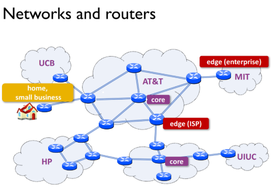
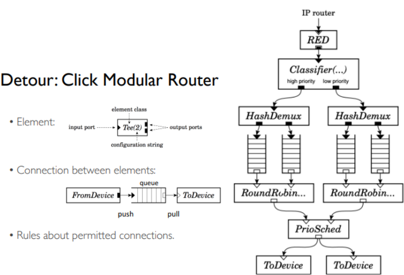
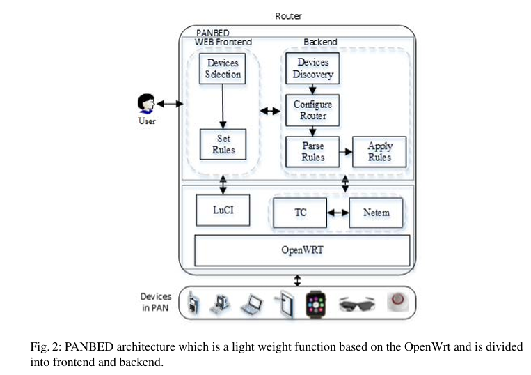

---

layout: post
title:  "Glimpse about a router firmware "
date: 2026-05-08 
tags: [Jekyll, GitHub, Git, Markdown, Blog, router, firmware, openWrt, linux kernel, networks]
---

Most of us use a Wi-Fi router every day without thinking much about what is happening inside it.  
We connect our phones or laptops to the internet, and somehow the router makes everything work.

But behind the blinking lights and antennas, a router is actually a small computer.

For better understanding refer https://www.cloudflare.com/learning/network-layer/what-is-a-router/

Credits - https://courses.grainger.illinois.edu/ece598hpn/fa2022/slides/lect8-softwarerouters.pdf

Just like a computer runs an operating system such as Windows or Ubuntu, a router also needs software to function.  
This special software is called **firmware**.

The firmware acts as the brain of the router. It helps the router:

- send internet data to the correct device
- manage Wi-Fi connections
- provide security through firewall rules
- assign IP addresses to devices
- control network settings

Without firmware, the router hardware would not know what to do.

Unlike desktop operating systems, router firmware is usually lightweight because routers have limited memory and processing power. Most modern routers use a customized version of Linux designed specifically for networking tasks.

Popular router firmware systems include:

- OpenWrt
- DD-WRT
- Tomato

In this article, we will take a simple look inside router firmware and understand the major software components that help a router operate behind the scenes.

## The Software Inside the Router

A router firmware is not a single program.  
It is a collection of smaller software components working together behind the scenes.

Some manage Wi-Fi, some provide security, while others help devices connect to the internet.

Even though users only see a simple settings page, many background services are constantly running inside the router.

---

## Linux Kernel — The Core

At the heart of most modern routers is the Linux kernel.

It interacts with the hardware and handles core networking tasks such as forwarding data between devices.

It acts as the foundation on which the rest of the router software runs.

---

## Web Interface — The Control Panel

The router settings page we open in a browser is provided by a web interface.

In OpenWrt, this interface is called **LuCI**.

It allows users to:

- change Wi-Fi passwords
- configure firewall settings
- view connected devices
- restart services

without using terminal commands.

---

## DHCP and DNS Services

When a phone or laptop connects to the router, it needs an IP address.

A background service automatically assigns these addresses using DHCP.

Routers also convert website names such as `google.com` into numerical IP addresses using DNS services.

---

## Firewall — The Security Guard

The firewall monitors incoming and outgoing network traffic.

It helps block suspicious connections and protects devices inside the local network from unwanted access.

---

## Wi-Fi Management Software

Special software inside the router manages wireless communication.

It handles:

- Wi-Fi authentication
- encryption
- signal broadcasting
- device connections

This helps devices connect securely to the network.

## How Does the Software Inside a Router Work?

Credits - Xu, Qiaozhi & Zhang, Junxing. (2017). Building a lightweight testbed using devices in personal area networks. Computer Science and Information Systems. 14. 857-873. 10.2298/CSIS161230033X. 

Inside a router, multiple software components continuously communicate with each other to process network traffic.

Whenever a device sends a request — for example opening a website - the router software handles it step by step.

A simplified flow looks like this:

1. A device sends data to the router.
2. The Linux kernel receives the network packet.
3. Firewall rules check whether the traffic is allowed.
4. Routing logic decides where the packet should go.
5. Network Address Translation (NAT) may modify the packet information.
6. The packet is forwarded to the internet.

At the same time, other background services may also be running:

- DHCP services assigning IP addresses
- DNS services translating website names
- Wi-Fi management software handling wireless connections
- Web interface services waiting for user configuration requests

All these smaller programs work together like different departments inside a system.

Instead of one large application, router firmware is designed as a collection of lightweight services communicating with each other continuously.

## openWrt - an open source router firmware

In my jouney of getting to know more about a router software, openWRt seems to be a very important, primarily because it is used in many of our home routers like d-link, jio etc.

openWrt is fully customizable accoring to a hardware needs of router/device even so much that it can be used on rasberry pi.

To get know about it more refer https://openwrt.org/
or I found an excellent course on it at youtube [OpenWRT Complete Course become ZERO to HERO][OpenWRT-Complete-Course-become-ZERO-to-HERO].

Enterprise routers typically run specialized firmware such as Cisco IOS on more capable hardware.

These systems are designed for high reliability and continuous operation, since software failures or downtime are often unacceptable in industrial and enterprise environments.

---

In the next blog post, we will dive deeper into the world of router firmware using OpenWrt and explore how the software inside a router actually works behind the scenes.

[OpenWRT-Complete-Course-become-ZERO-to-HERO]: https://youtu.be/MB2QLwgI1sw?si=Jq-AOqrSLE5Es3Ql

